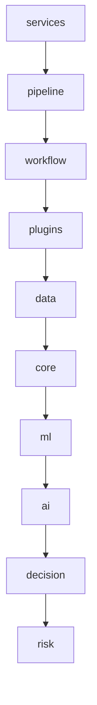

# Foundation Layer Diagram

```mermaid
flowchart TD
  services[services] --> pipeline[pipeline]
  pipeline --> workflow[workflow]
  workflow --> plugins[plugins]
  plugins --> data[data]
  data --> core[core]
  core --> ml[ml]
  ml --> ai[ai]
  ai --> decision[decision]
  decision --> risk[risk]
```

Import direction: higher may use lower; reverse forbidden. See `docs/architecture/foundation_freeze.md`.
