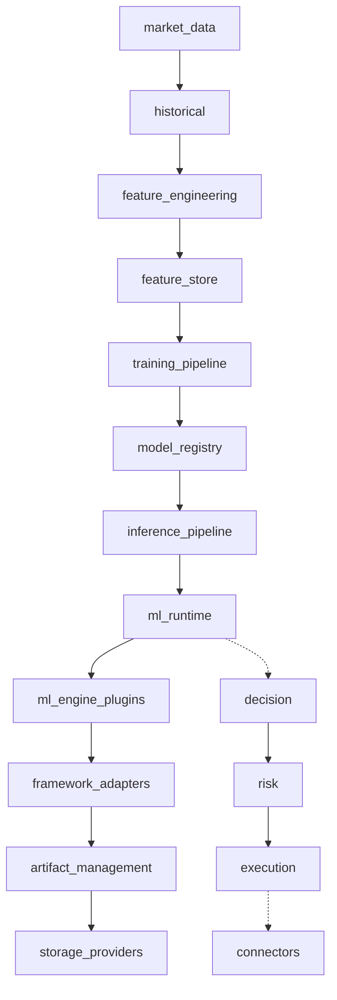

# Implemented Dependency Diagram (Simplified)

```mermaid
flowchart TD
  market_data[market_data] --> historical[historical]
  historical --> feature_engineering[feature_engineering]
  feature_engineering --> feature_store[feature_store]
  feature_store --> training_pipeline[training_pipeline]
  training_pipeline --> model_registry[model_registry]
  model_registry --> inference_pipeline[inference_pipeline]
  inference_pipeline --> ml_runtime[ml_runtime]
  ml_runtime --> ml_engine_plugins[ml_engine_plugins]
  ml_engine_plugins --> framework_adapters[framework_adapters]
  framework_adapters --> artifact_management[artifact_management]
  artifact_management --> storage_providers[storage_providers]

  ml_runtime -.-> decision[decision]
  decision --> risk[risk]
  risk --> execution[execution]
  execution -.-> connectors[connectors]
```

Dashed edges indicate product orchestration intent; enforce actual imports via import-linter before coding.
