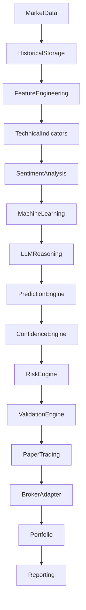

# Vision Pipeline Diagram

```mermaid
flowchart TD
  marketData[MarketData]
  historical[HistoricalStorage]
  featureEng[FeatureEngineering]
  indicators[TechnicalIndicators]
  sentiment[SentimentAnalysis]
  ml[MachineLearning]
  llm[LLMReasoning]
  prediction[PredictionEngine]
  confidence[ConfidenceEngine]
  risk[RiskEngine]
  validation[ValidationEngine]
  paper[PaperTrading]
  broker[BrokerAdapter]
  portfolio[Portfolio]
  reporting[Reporting]

  marketData --> historical
  historical --> featureEng
  featureEng --> indicators
  indicators --> sentiment
  sentiment --> ml
  ml --> llm
  llm --> prediction
  prediction --> confidence
  confidence --> risk
  risk --> validation
  validation --> paper
  paper --> broker
  broker --> portfolio
  portfolio --> reporting
```

**Note:** Stages without matching production packages are roadmap-only. Broker stays disabled until approved.
